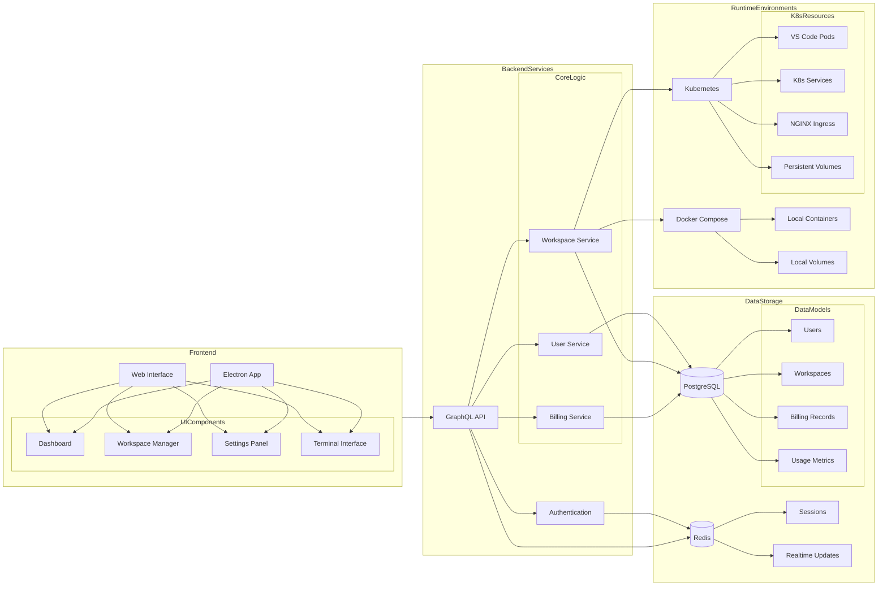
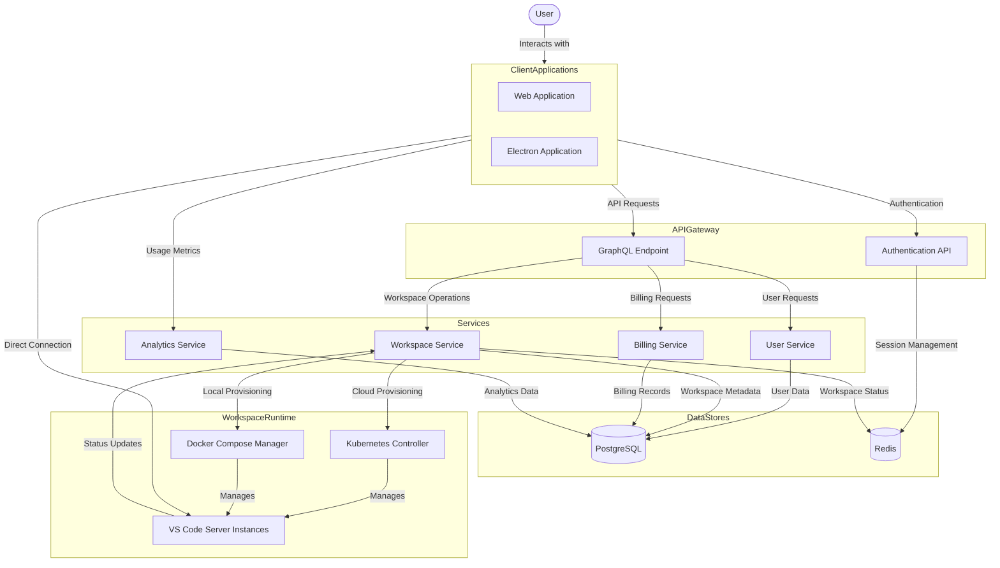

## SKYLI

#### *Your Workspace, Everywhere - The Cloud-Native Development Environment Platform similar to replit*

  <a href="#"><kbd>   About   </kbd></a>&ensp;&ensp;
  <a href="#"><kbd>   Stack   </kbd></a>&ensp;&ensp;
  <a href="#"><kbd>   Architecture   </kbd></a>&ensp;&ensp;
  <a href="#"><kbd>   Overview   </kbd></a>&ensp;&ensp;
  <a href="#"><kbd>   Conclusion   </kbd></a>

### About 🚀

**SKYLI** is a comprehensive development environment platform designed to provide developers with remote VS Code workspaces accessible from anywhere. Built on modern cloud-native technologies, SKYLI offers both **cloud-hosted and local deployment options**, enabling developers to maintain consistent, powerful development environments regardless of their physical device or location.

This report outlines the detailed technical architecture, implementation strategy, and deployment models for SKYLI, providing a comprehensive blueprint for development and operation.

### Technology Stack Overview

#### Frontend Technologies

| Technology         | Purpose                      | Implementation Details                                                                   |
| ------------------ | ---------------------------- | ---------------------------------------------------------------------------------------- |
| **Next.js**        | Core frontend framework      | Utilizing App Router for enhanced routing and Server Components for improved performance |
| **Tailwind CSS**   | Utility-first styling        | Custom theme configuration with SKYLI branding colors and design tokens                  |
| **Shadcn UI**      | Component library            | Accessible, customizable UI components with consistent design language                   |
| **Lucide**         | Icon system                  | Comprehensive icon set for UI elements with consistent styling                           |
| **Next-themes**    | Theme management             | Dark/light mode support with system preference detection                                 |
| **Zustand**        | Client-side state management | Lightweight state management for UI state with minimal boilerplate                       |
| **TanStack Query** | Data fetching & caching      | Type-safe data fetching with automatic caching and background refetching                 |
| **Better Auth**    | Authentication framework     | Secure authentication flows with multiple provider support                               |
| **Zod**            | Schema validation            | Runtime type validation for form inputs and API payloads                                 |

#### Backend Technologies

| Technology      | Purpose                 | Implementation Details                                                  |
| --------------- | ----------------------- | ----------------------------------------------------------------------- |
| **GraphQL API** | Data querying           | Type-safe API with schema-based validation and efficient data retrieval |
| **PostgreSQL**  | Primary database        | Storing user accounts, workspace metadata, and billing information      |
| **Redis**       | Caching & messaging     | Session storage, real-time updates, and inter-service communication     |
| **Prisma**      | ORM & database access   | Type-safe database queries with migration support                       |
| **Kubernetes**  | Container orchestration | Managing VS Code server instances with automated scaling                |
| **NGINX**       | Ingress controller      | Routing traffic to appropriate VS Code instances with SSL termination   |
| **Umami**       | Analytics               | Self-hosted, privacy-focused usage analytics                            |
| **BugSink**     | Error tracking          | Self-hosted Sentry alternative for error monitoring and reporting       |
| **Stripe**      | Payment processing      | Subscription and usage-based billing for cloud workspaces               |

#### DevOps & Infrastructure

| Technology         | Purpose               | Implementation Details                                           |
| ------------------ | --------------------- | ---------------------------------------------------------------- |
| **GitHub Actions** | CI/CD                 | Automated testing, building, and deployment pipeline             |
| **Docker**         | Containerization      | Packaging VS Code server and application components              |
| **Docker Compose** | Local development     | Simplified local environment setup for development               |
| **Lens**           | Kubernetes management | Visual interface for monitoring and managing Kubernetes clusters |
| **K9s**            | Kubernetes CLI        | Terminal-based management of Kubernetes resources                |

### System Architecture

#### High level overview

#### User Flow Diagram

#### Component Interactions

1. **User Authentication Flow**:
   - User authenticates via the SKYLI web interface
   - Better Auth handles authentication with JWT tokens
   - User session established with Redis for state management
   - PostgreSQL stores persistent user data and preferences

2. **Workspace Provisioning Flow**:
   - User requests new workspace via GraphQL API
   - Kubernetes controller receives workspace creation request
   - Controller provisions new VS Code server container
   - NGINX ingress configured for custom subdomain access
   - Workspace details returned to user via GraphQL API

3. **Local Deployment Flow**:
   - User installs SKYLI local application (Electron-based)
   - Application manages Docker Compose configuration locally
   - VS Code server instances run as containers on user's machine
   - Local proxy provides web access to VS Code instances

### Master Architecture Diagram

```mermaid
flowchart TB
    %% User Entry Points
    User([User]) -->|Accesses| WebUI[Web Interface\nNext.js + Tailwind + ShadcnUI]
    User -->|Installs| ElectronApp[Electron App\nCross-platform]
    Developer([Developer]) -->|Commits Code| GitRepo[GitHub Repository]
    
    %% Authentication Flow
    WebUI -->|Auth Request| AuthService{Authentication Service\nBetter Auth}
    ElectronApp -->|Auth Request| AuthService
    AuthService -->|OAuth| GitProviders[GitHub/GitLab OAuth]
    AuthService -->|Username/Password| CredentialVerify[Credential Verification]
    AuthService -->|2FA Verification| TwoFactor[2FA Service]
    AuthService -->|Issues| JWTService[JWT Token Service]
    JWTService -->|Stores| RedisSession[(Redis Session Store)]
    AuthService -->|User Records| UserDB[(PostgreSQL\nUser Tables)]
    
    %% Frontend Components
    WebUI --> Dashboard[Dashboard View]
    WebUI --> WorkspaceManagement[Workspace Management]
    WebUI --> SettingsPanel[Settings & Preferences]
    WebUI --> BillingUI[Billing & Subscription UI]
    WebUI --> AdminPanel[Admin Panel]
    ElectronApp --> LocalDashboard[Local Dashboard]
    ElectronApp --> LocalWorkspaceManagement[Local Workspace Management]
    ElectronApp -->|Controls| DockerEngineAPI[Docker Engine API]
    
    %% API Gateway & GraphQL
    WebUI -->|API Requests| APIGateway{GraphQL API Gateway}
    ElectronApp -->|API Requests| APIGateway
    APIGateway -->|Validates| JWTService
    
    %% Core Services
    APIGateway -->|User Operations| UserService[User Service]
    APIGateway -->|Workspace Operations| WorkspaceService[Workspace Service]
    APIGateway -->|Billing Operations| BillingService[Billing Service]
    APIGateway -->|Template Operations| TemplateService[Template Service]
    APIGateway -->|Analytics Queries| AnalyticsService[Analytics Service]
    APIGateway -->|Team Operations| TeamService[Team & Organization Service]
    
    %% Database Interactions
    UserService -->|CRUD Operations| UserDB
    WorkspaceService -->|Metadata Storage| WorkspaceDB[(PostgreSQL\nWorkspace Tables)]
    BillingService -->|Subscription Data| BillingDB[(PostgreSQL\nBilling Tables)]
    TeamService -->|Team Data| TeamDB[(PostgreSQL\nTeam Tables)]
    TemplateService -->|Template Storage| TemplateDB[(PostgreSQL\nTemplate Tables)]
    AnalyticsService -->|Usage Data| AnalyticsDB[(PostgreSQL\nAnalytics Tables)]
    
    %% Redis Cache
    UserService -->|Cache User Data| RedisCache[(Redis Cache)]
    WorkspaceService -->|Cache Status| RedisCache
    WorkspaceService -->|Pub/Sub Events| RedisPubSub[Redis Pub/Sub]
    RedisPubSub -->|Status Updates| WebUI
    RedisPubSub -->|Status Updates| ElectronApp
    
    %% Workspace Runtime - Kubernetes
    WorkspaceService -->|Cloud Provisioning| K8sController[Kubernetes Controller]
    K8sController -->|Creates| K8sResources{Kubernetes Resources}
    K8sResources -->|Deploys| Pods[VS Code Server Pods]
    K8sResources -->|Creates| K8sServices[Kubernetes Services]
    K8sResources -->|Configures| Ingress[NGINX Ingress]
    K8sResources -->|Allocates| PVCs[Persistent Volume Claims]
    K8sResources -->|Applies| NetworkPolicies[Network Policies]
    K8sResources -->|Sets| ResourceQuotas[Resource Quotas]
    Pods -->|Run| VSCodeContainer[VS Code Server Container]
    Ingress -->|Routes to| K8sServices
    K8sServices -->|Expose| Pods
    WebUI -->|Direct Connection| VSCodeContainer
    VSCodeContainer -->|Git Operations| GitProviders
    VSCodeContainer -->|File Access| PVCs
    
    %% Workspace Runtime - Docker Compose
    WorkspaceService -->|Local Provisioning| ComposeManager[Docker Compose Manager]
    ComposeManager -->|Manages| ComposeConfig[Docker Compose Config]
    ComposeConfig -->|Defines| LocalContainers[Local VS Code Containers]
    ComposeConfig -->|Maps| LocalVolumes[Local Volumes]
    ComposeConfig -->|Sets| LocalNetworking[Local Network Config]
    DockerEngineAPI -->|Controls| LocalContainers
    
    %% Billing and Payments
    BillingService -->|Processes Payments| StripeAPI[Stripe API]
    BillingService -->|Tracks| UsageMetering[Resource Usage Metering]
    StripeAPI -->|Payment Methods| PaymentDB[(Stripe Payment Tokens)]
    BillingService -->|Subscription Plans| SubscriptionDB[(Plan Definitions)]
    WorkspaceService -->|Usage Data| UsageMetering
    UsageMetering -->|Records| UsageDB[(Usage Records)]
    BillingService -->|Generates| Invoices[Invoice Generation]
    Invoices -->|Sends| EmailService[Email Service]
    
    %% CI/CD Pipeline
    GitRepo -->|Triggers| GithubActions[GitHub Actions CI/CD]
    GithubActions -->|Runs| Linting[Code Linting]
    GithubActions -->|Executes| Testing[Automated Tests]
    GithubActions -->|Builds| DockerBuild[Docker Image Build]
    DockerBuild -->|Pushes to| DockerRegistry[Docker Registry]
    GithubActions -->|Updates| K8sManifests[Kubernetes Manifests]
    K8sManifests -->|Applied to| DevEnvironment[Development Environment]
    K8sManifests -->|With Approval| StagingEnvironment[Staging Environment]
    K8sManifests -->|With Approval| ProductionEnvironment[Production Environment]
    
    %% Monitoring and Observability
    WebUI -->|User Analytics| UmamiAnalytics[Umami Analytics]
    WebUI -->|Error Tracking| BugsinkClient[Bugsink Client]
    APIGateway -->|API Metrics| APIMetrics[API Metrics Collection]
    K8sController -->|Pod Metrics| PodMetrics[Pod Metrics Collection]
    WorkspaceService -->|Log Events| LogCollection[Centralized Logging]
    UserService -->|Log Events| LogCollection
    BillingService -->|Log Events| LogCollection
    APIGateway -->|Log Events| LogCollection
    BugsinkClient -->|Reports| BugsinkServer[Bugsink Server]
    UmamiAnalytics -->|Stores| AnalyticsDB
    LogCollection -->|Stores| LogStorage[(Log Storage)]
    APIMetrics -->|Alerts| AlertManager[Alert Manager]
    PodMetrics -->|Alerts| AlertManager
    AlertManager -->|Notifies| OnCallSystem[On-Call System]
    
    %% Backup and Disaster Recovery
    BackupManager[Backup Service] -->|Snapshots| WorkspaceDB
    BackupManager -->|Snapshots| UserDB
    BackupManager -->|Snapshots| BillingDB
    BackupManager -->|Volume Backups| PVCs
    BackupManager -->|Stores| BackupStorage[(Backup Storage)]
    
    %% User Flows
    subgraph UserFlows [User Flows]
        direction TB
        uf1[Sign Up Flow] --> uf2[Create Workspace]
        uf2 --> uf3[Access VS Code]
        uf3 --> uf4[Install Extensions]
        uf3 --> uf5[Terminal Access]
        uf3 --> uf6[Git Integration]
        uf4 --> uf7[Develop Code]
        uf5 --> uf7
        uf6 --> uf7
        uf2 --> uf8[Save Template]
        uf8 --> uf9[Share Template]
        uf1 --> uf10[Create Team]
        uf10 --> uf11[Invite Members]
        uf11 --> uf12[Manage Permissions]
        uf1 --> uf13[Subscribe]
        uf13 --> uf14[Payment]
        uf14 --> uf15[Access Premium Features]
    end
    
    %% Security Components
    SecurityScanner[Security Scanner] -->|Scans| GitRepo
    SecurityScanner -->|Scans| DockerRegistry
    SecurityScanner -->|Reports| SecurityDB[(Security Findings)]
    Firewall[Web Application Firewall] -->|Protects| WebUI
    Firewall -->|Protects| APIGateway
    
    %% Data Flow
    WebUI -->|WebSocket| RealtimeService[Realtime Service]
    RealtimeService -->|Subscribes to| RedisPubSub
    VPNService[VPN Service] -->|Secure Access| InternalServices[Internal Services]
    
    %% Legend
    classDef userEndpoint fill:#f9f,stroke:#333,stroke-width:2px
    classDef frontend fill:#bbf,stroke:#333,stroke-width:1px
    classDef backend fill:#bfb,stroke:#333,stroke-width:1px
    classDef database fill:#fbb,stroke:#333,stroke-width:1px
    classDef kubernetes fill:#fbf,stroke:#333,stroke-width:1px
    classDef monitoring fill:#bff,stroke:#333,stroke-width:1px
    classDef security fill:#fdb,stroke:#333,stroke-width:1px
    classDef devops fill:#dfb,stroke:#333,stroke-width:1px
    
    class User,Developer userEndpoint
    class WebUI,ElectronApp,Dashboard,WorkspaceManagement,SettingsPanel,BillingUI,AdminPanel,LocalDashboard,LocalWorkspaceManagement frontend
    class APIGateway,UserService,WorkspaceService,BillingService,TemplateService,AnalyticsService,TeamService,AuthService,JWTService,CredentialVerify,TwoFactor backend
    class UserDB,WorkspaceDB,BillingDB,TeamDB,TemplateDB,AnalyticsDB,RedisCache,RedisSession,RedisPubSub,BackupStorage,LogStorage,SecurityDB,UsageDB,SubscriptionDB,PaymentDB database
    class K8sController,K8sResources,Pods,K8sServices,Ingress,PVCs,NetworkPolicies,ResourceQuotas,VSCodeContainer kubernetes
    class UmamiAnalytics,BugsinkClient,BugsinkServer,APIMetrics,PodMetrics,LogCollection,AlertManager,OnCallSystem monitoring
    class SecurityScanner,Firewall,VPNService security
    class GitRepo,GithubActions,Linting,Testing,DockerBuild,DockerRegistry,K8sManifests,DevEnvironment,StagingEnvironment,ProductionEnvironment,BackupManager devops
```

### Conclusion

The SKYLI platform represents a comprehensive solution for cloud-native development environments, combining the power of VS Code with the flexibility of containerized deployments. With both cloud-hosted and local options, SKYLI provides developers with consistent, powerful development environments accessible from anywhere.

The technology stack and architecture outlined in this report provide a solid foundation for building a scalable, secure, and feature-rich platform that addresses the evolving needs of modern software development teams.
